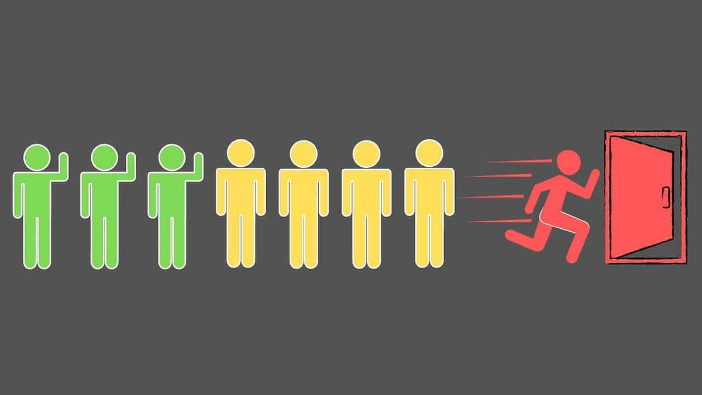
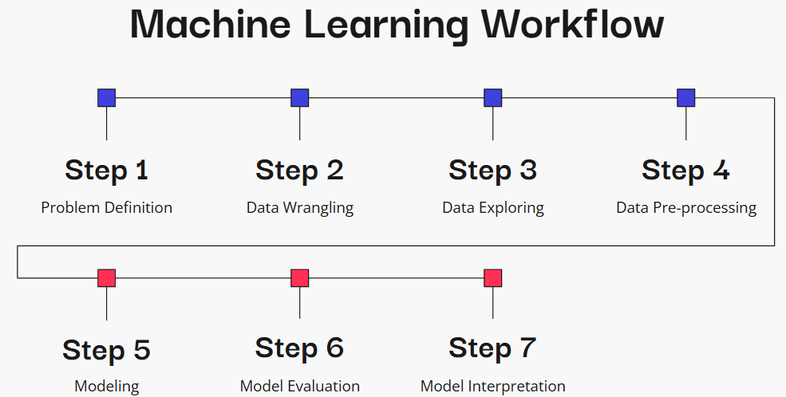
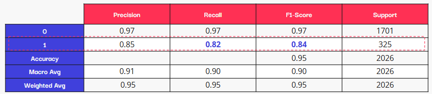
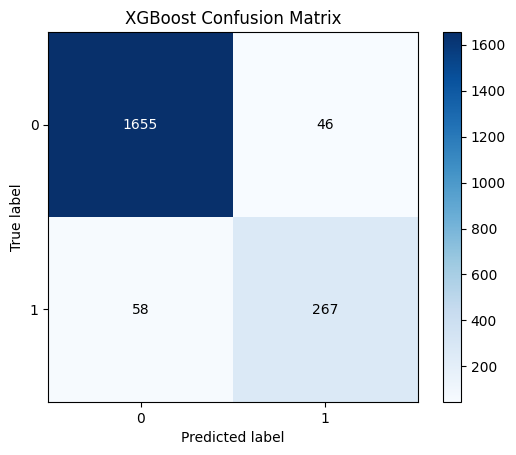
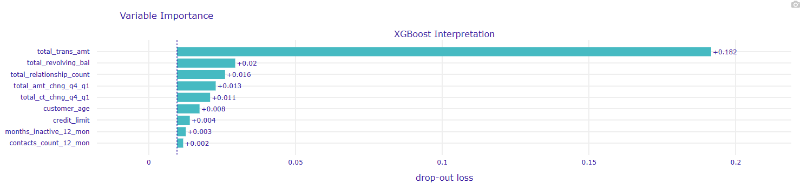

# **Cuans Bank Customer Attrition Prediction Model**

---

## **Project Overview:**

* **Business Context:**

Customer attrition, also known as customer churn, is a significant challenge for banks and financial institutions. It refers to the phenomenon where customers stop using a bank's services, leading to a loss of revenue and potentially harming the bank's reputation. Cuans Bank faces a similar challenge and aims to proactively address customer attrition to enhance customer retention and overall business performance.

* **Data Source:**

The project will utilize a dataset named "bank_churn_data.csv" containing information on 10,000 rows. This dataset includes 21 columns capturing customer profiles (age, gender, education, marital status, income, etc.), account details (credit limit, card category, months on book, etc.), and customer activity (transactions, inactivity periods, contacts with the bank, etc.).

* **Objective:**

  * **Identify Key Drivers of Attrition:** Determine the features that have the most significant impact on customer churn, providing insights into the factors leading to attrition.
  * **Develop a Predictive Model:** Build a robust machine learning model that accurately predicts customers at high risk of attrition. The model should prioritize high recall, F1-score, and a low False Negative Rate to minimize the chances of missing potential churn cases.
  * **Gain Actionable Insights:** Understand the underlying patterns and relationships between customer behavior and attrition to inform targeted retention strategies. And develop specific recommendations on how to mitigate the issues found.

* **Workflow:**

## **Results:**

The XGBoost model effectively predicts customer attrition with a high recall score of 0.82, meaning it accurately identifies a large portion of customers likely to churn. This is valuable despite data imbalance and minimizes the risk of missing potential attrition cases.

From 2026 rows of test data, the FN number seems lower when it has fewer of the number predicted class 1 (58 of total class 1 = 325) than the TP. When the aim is to minimize the FN, I think this XGBoost model is very well to represent it.

Features driving attrition:
* Higher Impact on attrition probability
  * `Total transaction amount`
  * `Total revolving balance`
  * `Total number of products used by customers`
  * `Total amount and credit change Q4-Q1`
* Smaller Impact on attrition probability
  * `Customer age`
  * `Credit limit`
  * `Months of the customer is Inactive in a year`
  * `Customer contacts count on 12 months`
 
    These factors individually had a smaller impact than the financial parameters mentioned above, but they still contribute to attrition predictions. Addressing customer concerns proactively, ensuring ease of use, and providing relevant information can potentially reduce attrition risks.

## **Recommendations for Bank to Prevent Customers from Attrition:**

* Develop tailored offers and incentives for at-risk customers to address their specific needs and potentially prevent attrition. This could include exclusive promotions per customer, banking product bundles, or loyalty programs.
* Engage proactively with customers experiencing a decrease in transaction amounts or changes in spending patterns. It can help identify potential issues early on and offer solutions before they lead to attrition.
* Ensure exceptional customer service and support to address concerns promptly and effectively. It can help prevent customer dissatisfaction and boost retention rates.
* Implement loyalty programs and rewards for long-term customers. Recognizing and appreciating their continued relationship with the bank can significantly reduce attrition.
* Utilize digital channels to communicate with customers, offer support, and collect feedback. It can improve customer engagement and satisfaction.

**By implementing these recommendations, the bank can make data-driven decisions to improve customer retention and prevent potential losses due to attrition.**

** *For better visibility on the Model Interpretation Section, please visit this code here* [https://colab.research.google.com/drive/1QDyAaLPJj9GZgGuB2OYzu8L5_z6FGMGS?usp=sharing](https://colab.research.google.com/drive/1QDyAaLPJj9GZgGuB2OYzu8L5_z6FGMGS?usp=sharing)

*** *Please also visit the deck here* [https://github.com/rijajir/Bank_Customer_Attrition_Prediction_Model/blob/main/deck/Bank_Customer_Attrition_Prediction_Model_Deck.pdf](https://github.com/rijajir/Bank_Customer_Attrition_Prediction_Model/blob/main/deck/Bank_Customer_Attrition_Prediction_Model_Deck.pdf)
